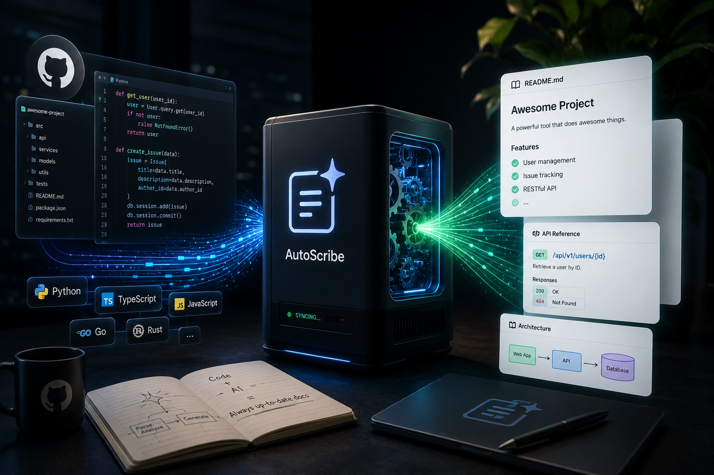

# AutoScribe

AI-powered documentation automation for GitHub repositories.




## What it does

AutoScribe connects to your GitHub account, analyzes your codebase, and automatically generates and maintains documentation — so it never goes stale as your code evolves.

## Tech Stack

| Layer | Technology |
|---|---|
| Frontend | React + TypeScript + Vite |
| Backend | FastAPI (Python) |
| Database | SQLite (local) / PostgreSQL (production) |
| Auth | GitHub OAuth |
| Background Jobs | Celery + Redis |
| AI | LLM-powered doc generation (Sprint 3+) |

## Getting Started

### Prerequisites

- Python 3.11 or 3.12
- Node.js 18+

### 1. Clone the repo

```bash
git clone https://github.com/your-username/AutoScribe.git
cd AutoScribe
```

### 2. Set up the backend

```bash
cd backend
python -m venv venv
venv\Scripts\activate        # Windows
# source venv/bin/activate   # Mac/Linux
pip install -r requirements.txt
```

### 3. Create `backend/.env`

```env
DATABASE_URL=sqlite+aiosqlite:///./autoscribe.db
REDIS_URL=redis://localhost:6379/0
SECRET_KEY=your-secret-key
GITHUB_CLIENT_ID=your-github-client-id
GITHUB_CLIENT_SECRET=your-github-client-secret
GITHUB_WEBHOOK_SECRET=
```

To get GitHub credentials:
1. Go to https://github.com/settings/developers
2. Click **New OAuth App**
3. Set callback URL to `http://localhost:8000/api/v1/auth/github/callback`
4. Copy the Client ID and Client Secret into `.env`

### 4. Run the backend

```bash
cd backend
uvicorn app.main:app --reload --port 8000
```

### 5. Set up and run the frontend

```bash
cd frontend
npm install
npm run dev
```

### 6. Open the app

- **Frontend:** http://localhost:5173
- **API docs:** http://localhost:8000/docs

## Project Structure

```
AutoScribe/
├── backend/
│   ├── app/
│   │   ├── api/          # Route handlers (auth, repos, health)
│   │   ├── core/         # Config, database
│   │   ├── models/       # SQLAlchemy models
│   │   └── workers/      # Celery background tasks
│   ├── requirements.txt
│   └── .env
├── frontend/
│   ├── src/
│   │   ├── App.tsx
│   │   └── App.css
│   └── package.json
└── README.md
```

## Roadmap

- [x] Sprint 0 — Project setup, SQLite, CI
- [x] Sprint 1 — GitHub OAuth, user storage
- [ ] Sprint 2 — AST parsing with Tree-sitter
- [ ] Sprint 3 — README + API doc generation via LLM
- [ ] Sprint 4 — Celery async workers
- [ ] Sprint 5 — Staleness detection + incremental updates
- [ ] Sprint 6 — Semantic search + RAG Q&A
- [ ] Sprint 7 — Frontend dashboard + analytics

## License

MIT
